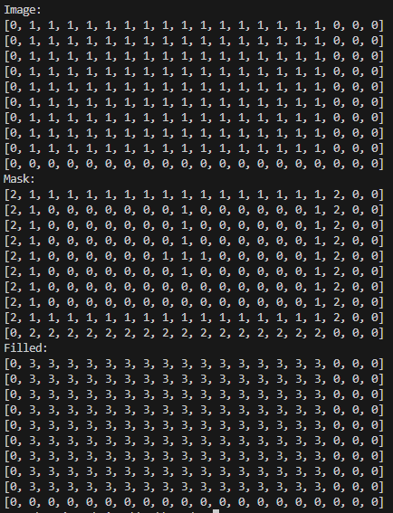

# bounds_tracing

Algorithm that traces an enclosed shape, then flood fills it

## Summary

This algorithm is used to trace the bounds of an enclosed shape, then flood fill it.
It may have some limitations when used on complex shapes, this is yet to be tested.

Written in Python for quick development and proof of concept.
The goal is to implement this into a mandelbrot set renderer to speed up rendering time.
Obviously, that won't be written in Python.

Ideally, we want to check the minimum amount of pixels for an enclosed shape of any complex shape or size. Covering every possible case, while also acheiving this, is much more complex than it seems.

## Output

## Usage

Just go run main.py and check the terminal for the output.

## Contributing

Feel free to open PRs or issues. The code is well documented but I barely understand what I'm doing, figuring it out as I go.
